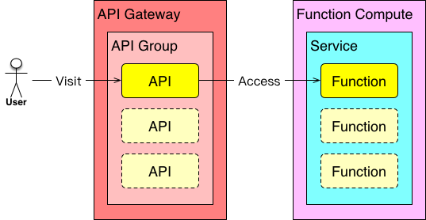

# (have)Fun with Serverless

It's a fun thing to programing with API Gateway & Function Compute.

## Installation

You can install it as a command line tool via NPM/yarn/CNPM

```sh
$ npm install @alicloud/fun
```

## Usage

The fun tool use `faas.yml` to describe the API Gateway & Function Compute things, then publish it online.

### faas.yml

The fun tool think a folder with `faas.yml` as a Serverless project. `faas.yml` describe these things:

- credentials
- role
- function compute
- api gateway

#### credentials

Includes account id, access key id, access key secret. It's optional. If not specificated by `faas.yml`, get it from environment variable.

```yaml
# faas.yml
accountid: '<account id, default is process.env.ACCOUNT_ID>'
accessKeyId: '<ACCESS KEY ID, default is process.env.ACCESS_KEY_ID>'
accessKeySecret: '<ACCESS KEY SECRET, default is process.env.ACCESS_KEY_SECRET>'
```

#### role

Give API Gateway right to access Function Computed. Optional.

```yaml
# faas.yml
role:
  name: 'apigatewayAccessFC'
```

#### Function Compute

Write your function into `hello.js` with:

```js
'use strict';

const hook = require('fc-helper');

exports.index = hook((req, res) => {
  res.send('Hello world!\n');
});
```

The helper.js can be found at here.

Describe it in faas.yml:

```yaml
# faas.yml
function-compute:
  region: 'cn-shanghai'
  services:
    - name: 'fc'
      description: 'fc test'
      functions:
        - name: 'helloworld'
          description: 'hello!'
          # entry point
          handler: hello.index
          # which files should be ziped
          code:
            - 'hello.js'
```

#### API Gateway

exports the functions with API Gateway:

```yaml
# faas.yml
api-gateway:
  endpoint: 'http://apigateway.cn-hangzhou.aliyuncs.com'
  groups:
    - name: 'apigw_fc'
      description: 'API Gateway & Function Compute'
      apis:
        - name: 'helloworld'
          method: 'GET'
          path: '/helloworld'
          function: 'cn-shanghai/fc/helloworld'
```

### Upload & deploy

Use `fun` command to upload & deploy it to AliCloud:

```sh
$ fun deploy
```

## Examples

- [Hello world](./examples/helloworld)
- [微信公众号自动回复](./examples/wechat)

## Architect

See relationship of API Gateway & Function Compute：



## Referrences

- [以函数计算作为 API 网关后端服务](https://help.aliyun.com/document_detail/54788.html)

## License

The MIT License
