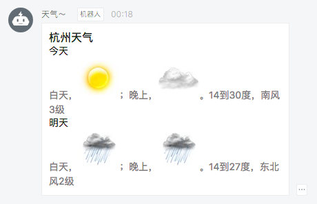

# Timer Trigger & Weather Notification

在钉钉中，心知天气是一个很流行的天气预报机器人，它可以定时地在钉钉群中发一条天气预报：


本次我们使用心知天气的 API 和函数计算来实现一个类似的机器人。

## Installation

You should install dependencies first:

### fun

```sh
$ npm install @alicloud/fun -g
```

### dependencies

```sh
$ npm install
```

## Account

- Function Compute Account
- 开通[钉钉群机器人](https://open-doc.dingtalk.com/docs/doc.htm?treeId=257&articleId=105735&docType=1)
  - 获取一个带 access token 的地址
- 开通[心知天气账号](https://www.seniverse.com/doc)
  - uid/apisecret

获取上述账户后，替换源码中的 \<UID\>/\<API SECRET\>/\<ACCESS TOKEN\>。

## Deploy

```sh
$ fun deploy
Function compute(cn-shanghai):
  service timer ok.
    function weather ok.
      trigger timer ok.
```

因为 fun 提供了对 trigger 的编排支持，所以在 function 下，我们可以增加 triggers 的定义。本例中的定义如下：

```yaml
Events:
  TmTrigger:
    Type: Timer
    Properties: 
      Payload: "awesome-fc"
      CronExpression: "0 0 8 * * *"
      Enable: true
```

### 执行示例



## Test

```sh
npm run test
```

## License

The MIT License
